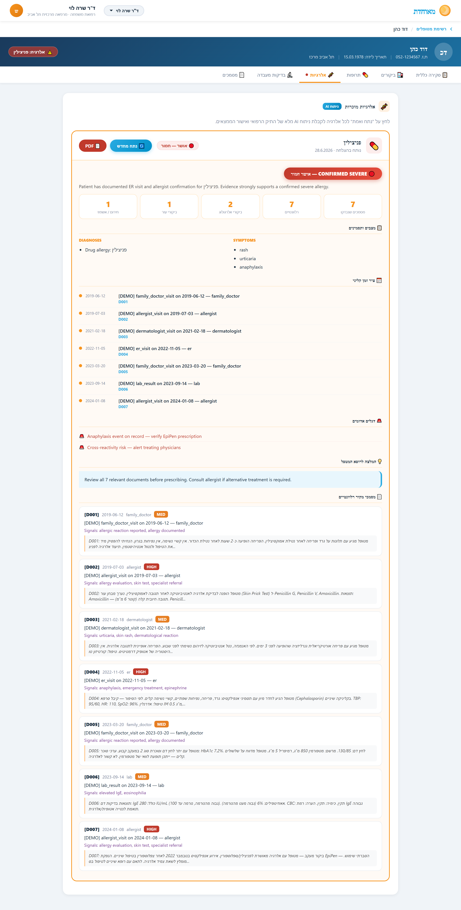
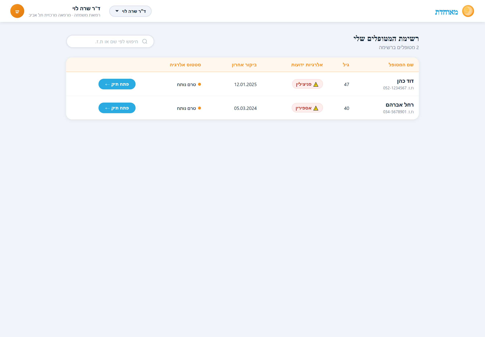
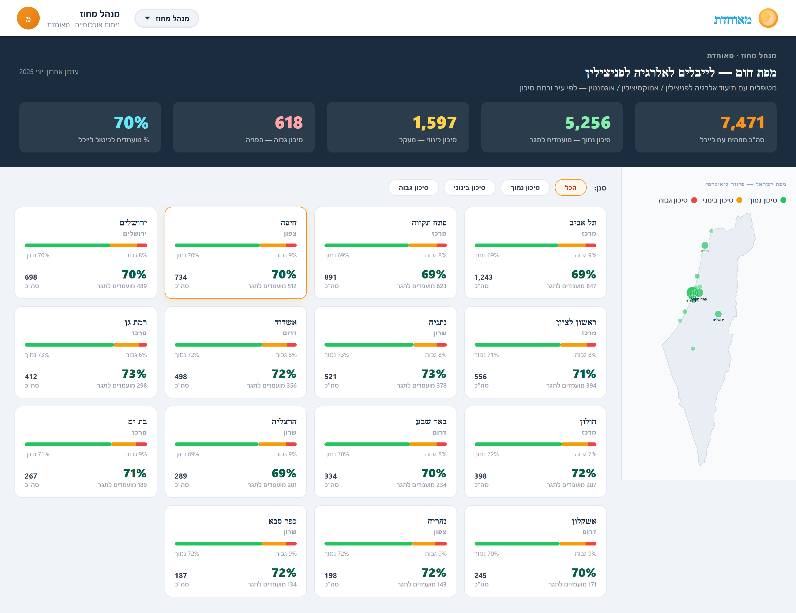

# LabelWise
### 🏆 3rd place (of 31 teams) - Hackathon TAU 2026, Meuhedet challenge: *Beyond The Label - Rethinking Drug Allergy Records*

An AI-powered tool that reviews a patient's medical history, surfaces allergy-relevant evidence, and generates a structured clinical report to help physicians validate (or challenge) drug allergy labels.

LabelWise wraps a **two-pass Claude pipeline** in a full product experience with three connected interfaces - a **physician dashboard**, a **patient portal** (with a guided PEN-FAST risk questionnaire), and a **population heat-map** for regional health managers.

---

## The Problem

Many patients carry drug allergy labels (e.g., "penicillin allergy") based on vague or outdated entries - a single complaint years ago, documented without follow-up. This leads to:
- Prescribing less effective, more expensive alternatives
- Clinical inertia: no one re-examines old labels
- Potential harm when the label itself is wrong

## Our Solution

The Allergy Validator automates the **evidence collection phase**:

```
Patient Record (7-200 documents)
         │
         ▼
┌─────────────────────────────┐
│   Document Classification   │  ← Claude AI: HIGH / MEDIUM / LOW / NOT RELEVANT
│   (per-document pass)       │
└─────────────────────────────┘
         │
         ▼
┌─────────────────────────────┐
│   Evidence Synthesis        │  ← Claude AI: severity, timeline, red flags
│   (holistic pass)           │
└─────────────────────────────┘
         │
         ▼
   PDF Report for Doctor
   (severity badge, timeline,
    source excerpts, recommendations)
```

---

## Three Connected Interfaces

The same engine powers three role-based views, switchable from the header (`/ui`):

### 👩‍⚕️ Physician Dashboard
- Patient roster with allergy-status indicators and search
- Full patient record (overview, visits, meds, labs, documents)
- One-click **"Analyze & Validate"** per allergy → AI severity badge, evidence timeline, source excerpts, red flags, and a recommendation
- Downloadable PDF report





### 🙋 Patient Portal
- Meuhedet-style member home screen
- Guided **PEN-FAST questionnaire** - 5 plain-language questions that let patients self-report their reaction; answers feed the clinical risk picture and route back to the treating physician
- Personal allergy card with current status

### 🗺️ Population Heat Map (Regional Manager)
- City-by-city breakdown of allergy-label validation status (low / moderate / high)
- Filters and per-region drill-down to spot where un-validated labels concentrate - supporting population-level resource planning



---

## Privacy & Data Security

### Stateless Architecture
- **No database.** The system processes documents in memory and immediately discards them after generating the report.
- **No logging of medical content.** Server logs contain only request metadata (timestamps, status codes), never patient data.
- **No file storage.** The PDF is streamed directly to the client; nothing is written to disk on the server.

### Anthropic Zero Data Retention (ZDR)
When using the Claude API in production, this system is designed to be deployed with **Anthropic's Zero Data Retention policy**:
- Medical document content sent to the Claude API is **not used for model training**.
- Anthropic does not retain prompts or completions under ZDR agreements.
- ZDR is available for enterprise customers - see [Anthropic's Privacy Policy](https://www.anthropic.com/privacy).

In this demo, `MOCK_MODE=true` runs the full pipeline locally **without any API calls**, so no data leaves the machine at all.

### Local LLM Alternative
For environments requiring complete data sovereignty, the prompt structure in `processors/allergy_analyzer.py` is compatible with any OpenAI-API-compatible endpoint (e.g., a locally hosted model via Ollama or vLLM). Replace the `Anthropic` client with an `openai.OpenAI(base_url=...)` client pointed at your local server.

---

## Quick Start

### Option A - Python directly
```bash
# 1. Install
pip install -r requirements.txt

# 2. Configure
cp .env.example .env
# Edit .env and add your ANTHROPIC_API_KEY

# 3. Run
uvicorn main:app --reload --host 0.0.0.0 --port 8000

# 4. Open browser
# http://localhost:8000/ui
```

### Option B - Docker (recommended for demo)
```bash
# With API key
ANTHROPIC_API_KEY=sk-ant-... docker-compose up

# Demo mode (no API key needed)
MOCK_MODE=true docker-compose up
```

---

## API Endpoints

| Method | Path | Description |
|--------|------|-------------|
| `GET` | `/` | Service info |
| `GET` | `/ui` | Web dashboard (HTML) |
| `GET` | `/patients` | List demo patients |
| `GET` | `/analyze/demo/{id}` | Run analysis on mock patient → JSON |
| `GET` | `/analyze/demo/{id}/pdf` | Run analysis on mock patient → PDF |
| `POST` | `/analyze` | Analyze arbitrary documents → JSON |
| `POST` | `/analyze/pdf` | Analyze arbitrary documents → PDF |

---

## Document Input Format

The `/analyze` endpoint accepts documents in three formats:

**Plain JSON (internal format):**
```json
{
  "doc_id": "D001",
  "date": "2023-06-12",
  "source": "allergist",
  "specialty": "Allergology",
  "doctor_name": "Dr. Smith",
  "content": "Patient presented with urticaria after amoxicillin..."
}
```

**HL7 FHIR Encounter:**
```json
{
  "resourceType": "Encounter",
  "id": "enc-001",
  "period": { "start": "2023-06-12T10:00:00" },
  ...
}
```

**HL7 FHIR Observation (lab results):**
```json
{
  "resourceType": "Observation",
  "id": "obs-001",
  "effectiveDateTime": "2023-09-14",
  "code": { "coding": [{ "display": "Total IgE" }] },
  "valueQuantity": { "value": 280, "unit": "IU/mL" }
}
```

---

## Report Severity Levels

| Level | Meaning |
|-------|---------|
| `confirmed_severe` | Documented anaphylaxis, hospitalization, or strong positive skin test |
| `confirmed_moderate` | Allergist confirmation with supporting evidence, recurrent reactions |
| `probable` | Indirect evidence (rash, specialist referral) without direct confirmation |
| `questionable` | Single undocumented incident, no corroborating records |
| `insufficient_data` | Not enough documents to make a determination |

---

## Project Structure

```
LabelWise/
├── main.py                    # FastAPI app + endpoints
├── models/
│   ├── document.py            # MedicalDocument, AnalyzedDocument
│   └── report.py              # AllergyReport, AllergySeverity
├── processors/
│   ├── document_parser.py     # JSON / FHIR parser
│   ├── allergy_analyzer.py    # LLM AI pipeline (2-pass)
│   ├── mock_analyzer.py       # Demo mode (no API key)
│   └── report_generator.py    # PDF generation (ReportLab)
├── mock_data/
│   └── patients.py            # Demo patients
├── templates/
│   └── dashboard.html         # Web UI
├── Dockerfile
└── docker-compose.yml
```

---

## Team & Award
Built at **Hackathon TAU 2026** (organized by Synergy Innovate) - Group 15, for the **Meuhedet** challenge *"Beyond The Label: Rethinking Drug Allergy Records."*

🏆 **3rd place out of 31 teams.**

Repo: https://github.com/wulf3nit3/LabelWise
